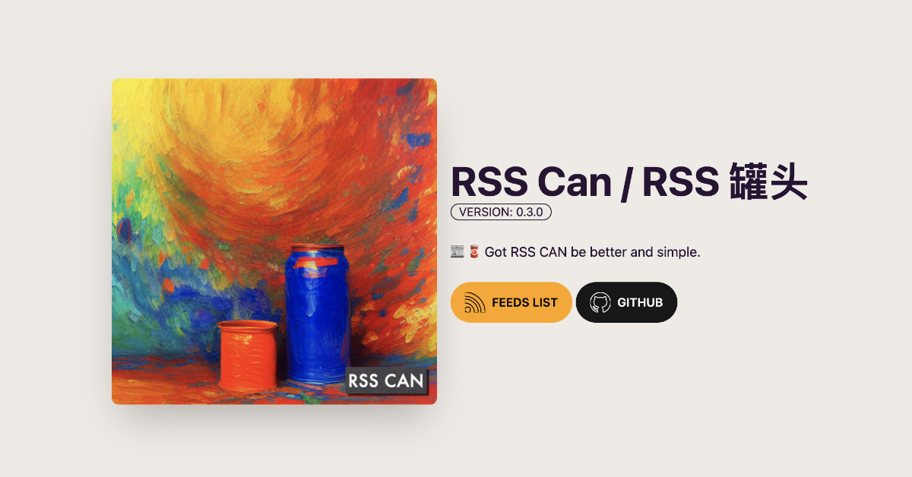

# RSS Can / RSS 罐头

[](https://github.com/soulteary/RSS-Can/actions/workflows/codeql.yml) [](https://github.com/soulteary/rss-can/actions/workflows/build.yml)   [](https://codecov.io/gh/soulteary/RSS-Can) [](https://hub.docker.com/r/soulteary/rss-can)

<p style="text-align: center;">
  <a href="README.md">ENGLISH</a> | <a href="README_CN.md"  target="_blank">中文文档</a>
</p>

📰 🥫 **Got RSS CAN be better and simple.**

<p style="text-align: center;">
  
</p>

<p style="text-align: center;">
  
</p>

## Supported Systems and Architectures

- Linux: AMD64(x86_64)
- macOS: AMD64(x86_64) /  ARMv64

## Usage

Download the binary from the github [release page](https://github.com/soulteary/RSS-Can/releases), with the following command:

```bash
./rssc
```

### Docker

Pull the docker image and mount the `Feed rules` file in the project to the docker container:

```
docker pull soulteary/rss-can:v0.3.6
docker run --rm -it -p 8080:8080 -v `pwd`/rules:/rules soulteary/rss-can:v0.3.6
```

### Cli Parameters & Environment

**All parameters are optional, please adjust according to your needs**

The parameters supported by the program can be obtained through `-h` or `--help`:

```bash
Usage of rssc:
  -debug RSS_DEBUG
    	whether to output debugging logging, env: RSS_DEBUG
  -debug-level RSS_DEBUG_LEVEL
    	set debug log printing level, env: RSS_DEBUG_LEVEL (default "info")
  -feed-path RSS_HTTP_FEED_PATH
    	http feed path, env: RSS_HTTP_FEED_PATH (default "/feed")
  -headless-addr RSS_HEADLESS_SERVER
    	set Headless server address, env: RSS_HEADLESS_SERVER (default "127.0.0.1:9222")
  -headless-slow-motion RSS_HEADLESS_SLOW_MOTION
    	set Headless slow motion, env: RSS_HEADLESS_SLOW_MOTION (default 2)
  -host RSS_HOST
    	web service listening address, env: RSS_HOST (default "0.0.0.0")
  -memory RSS_MEMORY
    	using Memory(build-in) as a cache service, env: RSS_MEMORY (default true)
  -memory-expiration RSS_MEMORY_EXPIRATION
    	set Memory cache expiration, env: RSS_MEMORY_EXPIRATION (default 600)
  -port RSS_PORT
    	web service listening port, env: RSS_PORT (default 8080)
  -proxy RSS_PROXY
    	Proxy, env: RSS_PROXY
  -redis RSS_REDIS
    	using Redis as a cache service, env: RSS_REDIS (default true)
  -redis-addr RSS_SERVER
    	set Redis server address, env: RSS_SERVER (default "127.0.0.1:6379")
  -redis-db RSS_REDIS_DB
    	set Redis db, env: RSS_REDIS_DB
  -redis-pass RSS_REDIS_PASSWD
    	set Redis password, env: RSS_REDIS_PASSWD
  -rod string
    	Set the default value of options used by rod.
  -rule RSS_RULE
    	set Rule directory, env: RSS_RULE (default "./rules")
  -timeout-headless RSS_HEADLESS_EXEC_TIMEOUT
    	set headless execution timeout, env: RSS_HEADLESS_EXEC_TIMEOUT (default 5)
  -timeout-js RSS_JS_EXEC_TIMEOUT
    	set js sandbox code execution timeout, env: RSS_JS_EXEC_TIMEOUT (default 200)
  -timeout-request RSS_REQUEST_TIMEOUT
    	set request timeout, env: RSS_REQUEST_TIMEOUT (default 5)
  -timeout-server RSS_SERVER_TIMEOUT
    	set web server response timeout, env: RSS_SERVER_TIMEOUT (default 8)
```

## Milestone

- [Base CLI & WebUI Support](https://github.com/soulteary/rss-can/issues/8)
- [Aggregate Results, JS SDK, Dockerize](https://github.com/soulteary/rss-can/issues/9)
- [Redis, in-memory cache, Dynamic loading rules](https://github.com/soulteary/rss-can/issues/10)
- [Charset auto detection, Mix parser support, Improve CSR, Muti-page data extract](https://github.com/soulteary/rss-can/issues/11)
- [Websites parsing via SSR render](https://github.com/soulteary/rss-can/issues/12), [Blog](https://soulteary.com/2022/12/12/rsscan-better-rsshub-service-build-with-golang-part-1.html)
- [Dynamic rule capability](https://github.com/soulteary/rss-can/issues/13), [Blog](https://soulteary.com/2022/12/13/rsscan-make-golang-applications-with-v8-part-2.html)
- [Convert website page as RSS feeds](https://github.com/soulteary/rss-can/issues/14), [Blog](https://soulteary.com/2022/12/14/rsscan-convert-website-information-stream-to-rss-feed-part-3.html)
- [Websites parsing via CSR render](https://github.com/soulteary/rss-can/issues/15), [Blog](https://soulteary.com/2022/12/15/rsscan-use-golang-rod-to-parse-the-content-dynamically-rendered-in-the-browser-part-4.html)

## PLAN

- [ ] Docs: Provide a simple tutorial on how to use Docker images with common technology stacks [#16](https://github.com/soulteary/rss-can/issues/16)
- [ ] Pipeline: Support RSS pipeline flow, customize information processing tasks and integrate other open-source software
- [ ] AI: NLP tasks
- [ ] Rules: Support merge open-source software rules: [rss-bridge](https://github.com/RSS-Bridge/rss-bridge/tree/master/bridges) / [RSSHub](https://github.com/DIYgod/RSSHub/tree/master/lib)
- [ ] Tools: Quick RSS rules generator, like: [damoeb/rss-proxy](https://github.com/damoeb/rss-proxy)

## License & Credits

This project is licensed under the [MIT License](https://github.com/soulteary/RSS-Can/blob/main/LICENSE)

The rapid evolution of the project is inseparable from the following excellent open source software, you can click this link to know who they are : [Credits](./CREDITS.md)
