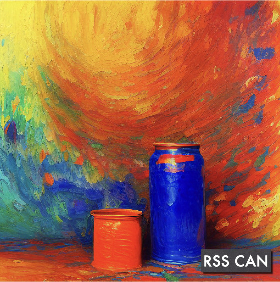

# RSS Can / RSS 罐头

 

📰 🥫 **Got RSS CAN be better and simple.**

  

*image generated by stable diffusion*

## PLAN

- Support fetch with CSR
- Dockerize
- Optimized for Golang 1.19
- Support RSS Pipeline
- NLP support
- [x] 2022.12.14 Support convert website page as RSS feeds.
- [x] 2022.12.13 Support dynamic rule capability, [Blog](https://soulteary.com/2022/12/13/rsscan-make-golang-applications-with-v8-part-2.html)
- [x] 2022.12.12 Support websites parsing via SSR render, [Blog](https://soulteary.com/2022/12/12/rsscan-better-rsshub-service-build-with-golang-part-1.html)

## License

This project is licensed under the [MIT License](https://github.com/soulteary/RSS-Can/blob/main/LICENSE)

## Credits

- [@PuerkitoBio](https://github.com/PuerkitoBio), He implements a good DOM parsing tool library [/goquery](https://github.com/PuerkitoBio/goquery) for Go under the [BSD-3-Clause license](https://github.com/PuerkitoBio/goquery/blob/master/LICENSE). In the project, it is used as a SSR method to parse remote document data. Because there is no Release for the new version, the code base used by the project is [[#3b7929a](https://github.com/PuerkitoBio/goquery/commit/3b7929a0d759a20968ba605c56bc3027c30d3527)].
- [@andybalholm](https://github.com/andybalholm), He implements a Go implementation of a CSS selector library [cascadia](https://github.com/andybalholm/cascadia), which is the core dependency of goquery under the [BSD-2-Clause license](https://github.com/andybalholm/cascadia/blob/master/LICENSE). Because there is no Release for the new version, the code base used by the project is [[#c6065e4](https://github.com/andybalholm/cascadia/commit/c6065e4618b7f538edf5ca0d6b5b2fd0fe129fdd)]
- [@rogchap](https://github.com/rogchap), He implements a good JavaScript runtime library [https://github.com/rogchap/v8go](https://github.com/rogchap/v8go) under the [BSD-3-Clause license](https://github.com/rogchap/v8go/blob/master/LICENSE). In the project, it used as a dynamic configuration execution sandbox environment with version [[v0.7.0](https://github.com/rogchap/v8go/releases/tag/v0.7.0)].
- [@gorilla](https://github.com/gorilla), Gorilla Web Toolkit Dev Team, they offer an amazing library of great tools, eg. [gorilla/feeds](https://github.com/gorilla/feeds) an tiny RSS generator library under the [BSD-2-Clause license](https://github.com/gorilla/feeds/blob/master/LICENSE). In the project, it is used as RSS generator. Sadly, the team decided to archive all projects on December 9th, 2022, the code base used by the project is [b60f215](https://github.com/gorilla/feeds/commit/b60f215f72c708b0800622c804167bea85539ea5).
- [@gin-gonic](https://github.com/gin-gonic), Gin-Gonic Dev Team, they offer an great HTTP web framework [gin](https://github.com/gin-gonic/gin) under the [MIT license](https://github.com/gin-gonic/gin/blob/master/LICENSE). In the project, it used as Web Server to provides RSS API. The code base is [v1.8.1](https://github.com/gin-gonic/gin/releases/tag/v1.8.1).
