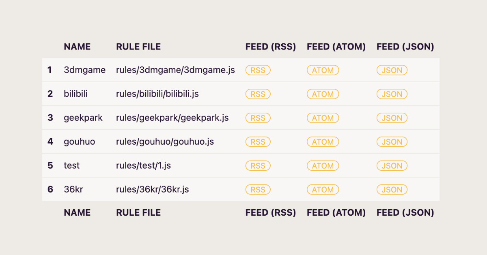

# RSS Can / RSS 罐头

[](https://github.com/soulteary/RSS-Can/actions/workflows/codeql.yml) [](https://github.com/soulteary/rss-can/actions/workflows/build.yml)   [](https://codecov.io/gh/soulteary/RSS-Can) [](https://hub.docker.com/r/soulteary/rss-can)

<p style="text-align: center;">
  <a href="README.md" target="_blank">ENGLISH</a> | <a href="README_CN.md">中文文档</a>
</p>

📰 🥫 **做更好的 RSS 聚合方案**

<p style="text-align: center;">
  
</p>

<p style="text-align: center;">
  
</p>

## 支持软硬件环境

- Linux: AMD64(x86_64)
- macOS: AMD64(x86_64) /  ARMv64

## 使用方法

从 GitHub 的软件发布页面，[下载软件](https://github.com/soulteary/RSS-Can/releases)之后，直接运行就可以啦：

```bash
./rssc
```

### Docker 容器方式运行

使用下面的命令，下载最新版本的软件之后，使用 `docker run` 运行即可（记得将项目中的 Feed Rules 挂载到容器中）：

```
docker pull soulteary/rss-can:0.3.5
docker run --rm -it -p 8080:8080 -v `pwd`/rules:/rules soulteary/rss-can:0.3.5
```

### 支持的命令行参数及环境变量

**所有的参数都是可选使用，根据自己的实际需要来即可。**

想要获取程序支持的参数，可以通过在执行程序后添加参数 `-h` 或者 `--help`：
 
```bash
Usage of rssc:
  -debug RSS_DEBUG
    	whether to output debugging logging, env: RSS_DEBUG
  -debug-level RSS_DEBUG_LEVEL
    	set debug log printing level, env: RSS_DEBUG_LEVEL (default "info")
  -feed-path RSS_HTTP_FEED_PATH
    	http feed path, env: RSS_HTTP_FEED_PATH (default "/feed")
  -headless-addr RSS_HEADLESS_SERVER
    	set Headless server address, env: RSS_HEADLESS_SERVER (default "127.0.0.1:9222")
  -headless-slow-motion RSS_HEADLESS_SLOW_MOTION
    	set Headless slow motion, env: RSS_HEADLESS_SLOW_MOTION (default 2)
  -host RSS_HOST
    	web service listening address, env: RSS_HOST (default "0.0.0.0")
  -memory RSS_MEMORY
    	using Memory(build-in) as a cache service, env: RSS_MEMORY (default true)
  -memory-expiration RSS_MEMORY_EXPIRATION
    	set Memory cache expiration, env: RSS_MEMORY_EXPIRATION (default 600)
  -port RSS_PORT
    	web service listening port, env: RSS_PORT (default 8080)
  -proxy RSS_PROXY
    	Proxy, env: RSS_PROXY
  -redis RSS_REDIS
    	using Redis as a cache service, env: RSS_REDIS (default true)
  -redis-addr RSS_SERVER
    	set Redis server address, env: RSS_SERVER (default "127.0.0.1:6379")
  -redis-db RSS_REDIS_DB
    	set Redis db, env: RSS_REDIS_DB
  -redis-pass RSS_REDIS_PASSWD
    	set Redis password, env: RSS_REDIS_PASSWD
  -rod string
    	Set the default value of options used by rod.
  -rule RSS_RULE
    	set Rule directory, env: RSS_RULE (default "./rules")
  -timeout-headless RSS_HEADLESS_EXEC_TIMEOUT
    	set headless execution timeout, env: RSS_HEADLESS_EXEC_TIMEOUT (default 5)
  -timeout-js RSS_JS_EXEC_TIMEOUT
    	set js sandbox code execution timeout, env: RSS_JS_EXEC_TIMEOUT (default 200)
  -timeout-request RSS_REQUEST_TIMEOUT
    	set request timeout, env: RSS_REQUEST_TIMEOUT (default 5)
  -timeout-server RSS_SERVER_TIMEOUT
    	set web server response timeout, env: RSS_SERVER_TIMEOUT (default 8)
```

## 里程碑

- [支持使用 CSR 解析模式处理数据](https://github.com/soulteary/rss-can/issues/15), [Blog](https://soulteary.com/2022/12/15/rsscan-use-golang-rod-to-parse-the-content-dynamically-rendered-in-the-browser-part-4.html)
- [支持将网站数据转换为可订阅的 RSS 订阅源](https://github.com/soulteary/rss-can/issues/14), [Blog](https://soulteary.com/2022/12/14/rsscan-convert-website-information-stream-to-rss-feed-part-3.html)
- [支持“动态化”能力](https://github.com/soulteary/rss-can/issues/13), [Blog](https://soulteary.com/2022/12/13/rsscan-make-golang-applications-with-v8-part-2.html)
- [支持自动解析目标网站的网页编码格式，支持混合解析模式，提供比 CSR 解析模式更快的处理速度，支持从其他页面抽取数据装填 RSS 列表页面数据](https://github.com/soulteary/rss-can/issues/11)
- [支持使用 SSR 解析模式处理数据](https://github.com/soulteary/rss-can/issues/12), [Blog](https://soulteary.com/2022/12/12/rsscan-better-rsshub-service-build-with-golang-part-1.html)
- [支持使用 Redis 和 应用内存 作为数据缓存，避免大量不必要的网络请求造成的麻烦，支持动态加载 RSS 规则文件](https://github.com/soulteary/rss-can/issues/10)
- [支持跨多个页面聚合信息为 RSS 订阅源，完成第一个版本的 JS SDK，发布，支持 Docker 镜像](https://github.com/soulteary/rss-can/issues/9)
- [程序支持参数化调用，发布版本；支持简单的 Web UI，以及新的参数，发布版本](https://github.com/soulteary/rss-can/issues/8)

## 项目计划

- [ ] 文档: 提供简单的教程和文档，阐述如何使用常见技术栈来玩转 RSS Can。
- [ ] Pipeline: 支持 RSS 信息流水线，能够定制信息处理任务，以及提供集成到各种开源软件的能力。
- [ ] AI: NLP 任务的集成和使用。
- [ ] 规则: 能够将社区两款软件的规则导入程序： [rss-bridge](https://github.com/RSS-Bridge/rss-bridge/tree/master/bridges) / [RSSHub](https://github.com/DIYgod/RSSHub/tree/master/lib)
- [ ] 工具: 支持通过界面工具快速生成规则，或参考: [damoeb/rss-proxy](https://github.com/damoeb/rss-proxy)


## License & Credits

This project is licensed under the [MIT License](https://github.com/soulteary/RSS-Can/blob/main/LICENSE)

项目的快速进化离不开下面优秀的开源软件，你可以点击这个链接，了解它们是谁：[Credits](./CREDITS.md)
